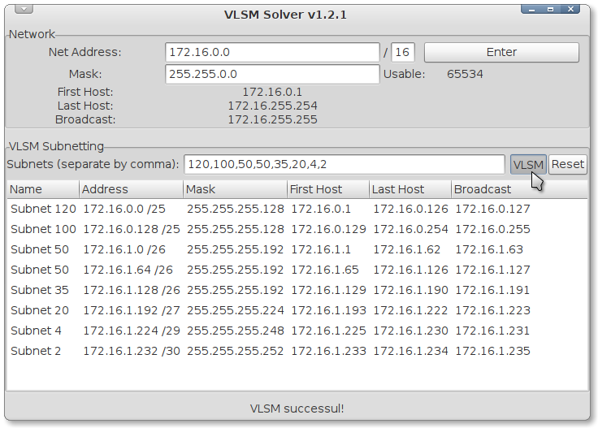
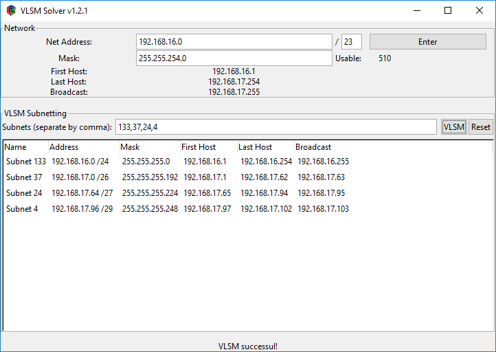

vlsmsolver
==========
v1.2.1 on 13 Jan 2011

vlsmsolver is a program that aims to help calculate [VLSM subnetting](https://www.computernetworkingnotes.com/ccna-study-guide/vlsm-subnetting-explained-with-examples.html)  
Written in pure C  
It provides command-line and GUI user interfaces using Gtk+ toolkit

mingw32 is used to cross-compile Windows build  
A build is included in the [release folder](release/vlsmsolver-v1.2.1-win32.zip)

Linux screenshot 

Windows screenshot 

